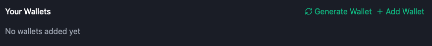

# 👜 Wallet Setup

## First of all go to [Settings](https://app.ethernyx.io/settings) page

## Now you can set up wallets in two ways:

* Create a new wallet.
* Import an existing wallet using a private key.

<figure><figcaption></figcaption></figure>

### How to Create a New Wallet

1. Click "Generate Wallet"
2. Save your private key in a secure location
3. Click "Save Wallet"


**Warning:** Ethernyx only shows your private key once. Make sure you save it.

Sharing your private key is the same as handing over your wallet and all your funds. Never share it with anyone!


### How to Import an Existing Wallet

1. Click "Add Wallet"
2. Enter the wallet private key you wish to import from an existing wallet (e.g MetaMask, Rabby)
3. Click "Save Wallet"

### How to Export Private Keys from MetaMask 

1. Open your MetaMask wallet.
2. Click the three vertical dots button in the top-right corner of the wallet menu.

1. Scroll and click on "Account details."

4. Select "Show Private Key."

5. Enter your password to continue.
6. Copy your private key and follow the instructions in the "How to Import an Existing Wallet" section above.

### Now you need to change your nickname on OpenSea to access OpenSea bidding:

1. Go to [Profile Settings](https://opensea.io/settings/profile) on OpenSea
2. Add the prefix "ethernyx\_dot\_io\_" before the nickname (e.g ethernyx\_dot\_io\_Misko4b)
3. Save settings


If your wallet has not yet made any offers on OpenSea, you need to make any offer for any collection manually first before starting tasks


